<div align="center">

<br/>

# Bagus Febriansyah Pratama

**Data Science Engineer** &nbsp;|&nbsp; **Machine Learning** &nbsp;|&nbsp; **Distributed Systems**

<br/>

[](https://fbrianzy.github.io/portofolio/)
[](https://www.linkedin.com/in/fbrianzy)
[](mailto:bagusfeb60@gmail.com)
[](https://gitlab.com/fbrianzy)
[](https://x.com/fbrianzy)

<br/>

</div>

---

## Overview

Data Science undergraduate at **Universitas Negeri Surabaya (UNESA)**, specializing in machine learning engineering, distributed computing, and applied analytics. I build production-grade data systems, deploy predictive models, and translate complex datasets into actionable intelligence.

> Transforming raw data into meaningful insights, one algorithm at a time.

<br/>

---

## Core Competencies

<table>
<tr>
<td width="50%">

**Machine Learning**
- Supervised and unsupervised learning
- Deep learning with TensorFlow and OpenCV
- Model deployment and MLOps pipelines
- Applied NLP and computer vision

</td>
<td width="50%">

**Data Engineering**
- Distributed computing with Apache Hadoop and Spark
- ETL pipeline design and orchestration
- Real-time and batch data processing
- Database architecture (SQL and NoSQL)

</td>
</tr>
<tr>
<td width="50%">

**Analytics**
- Statistical modeling and inference
- Data visualization and storytelling
- Business intelligence dashboards
- A/B testing and experimentation design

</td>
<td width="50%">

**Development**
- Full-stack web development
- Cloud infrastructure (AWS, Firebase, Cloudflare)
- Containerization with Docker
- API design and integration

</td>
</tr>
</table>

<br/>

---

## Featured Projects

<br/>

### &nbsp; &nbsp;InsightFlow
> Data insight and analytics hub for business intelligence and market trends

[](https://www.instagram.com/insightflowdata)

A platform delivering curated data narratives, analytics breakdowns, and market intelligence. Bridges the gap between raw data and business decision-making through accessible visual storytelling.


<br/>

### &nbsp; &nbsp;DepreScanAI
> Depression risk detection system based on lifestyle indicators

[](https://deprescanai.netlify.app/)
[](https://github.com/DepreScanAI)

A machine learning system that identifies depression risk through behavioral and lifestyle pattern analysis. Designed with clinical sensitivity and user privacy at its core, enabling early-stage mental health risk screening.


<br/>

### &nbsp; &nbsp;SavorSave
> Circular economy platform to reduce food waste

[](https://www.figma.com/proto/7kt9z4frJUfx8j4PNoFgy7/Prototype-SavorSave?node-id=0-1&t=uoJiKXzpPsdUqUNL-1)

A product design and platform concept addressing food waste through community redistribution and demand forecasting. Combines data-driven surplus prediction with an intuitive marketplace interface.


<br/>

### &nbsp; &nbsp;Dolen Cord
> Custom Discord bot with music, administration, and community automation

[](https://github.com/Dolen-Cord)

A full-featured Discord bot supporting community servers with automated moderation, music streaming, event management, and custom command tooling. Built with a focus on reliability and extensibility.


<br/>

---

## Developing Projects

<br/>

### Crypto Hourly
> Live BTC and ETH price tracker with 1-hour ahead predictions via 5-factor technical voting

[](https://fbrianzy.github.io/crypto-hourly/)
[](https://github.com/fbrianzy/crypto-hourly)
[](https://github.com/fbrianzy/crypto-hourly)

A fully automated static web dashboard that fetches BTC and ETH hourly candlestick data from CryptoCompare, computes 5 technical indicators (Momentum 1H/3H, EMA crossover, RSI, Bollinger Band), and generates UP/DOWN/HOLD signals via majority vote. Predictions update every 15 minutes through a GitHub Actions scheduled workflow. AI narrative insights are generated via Groq (llama-3.1-8b-instant) and broadcast to a Discord channel as a formatted PNG card.

**Architecture highlights:**
- Cron-based GitHub Actions pipeline running at `3,18,33,48 * * * *` with a 13-minute guard to prevent duplicate runs
- Signal logic: 5-factor vote where UP requires 4+ bullish votes; DOWN requires 2 or fewer; otherwise HOLD
- CairoSVG-rendered Discord notification cards with sparklines, indicator cells, and vote pip visualization
- Zero backend infrastructure: pure static site + data JSON committed by the workflow bot


<br/>

---

## Technology Stack

<br/>

**Languages**


<br/>

**Machine Learning and Data Science**


<br/>

**Distributed Systems and Big Data**


<br/>

**Web Development**


<br/>

**Cloud and Infrastructure**


<br/>

**Tooling**


<br/>

---

## GitHub Analytics

<div align="center">

<br/>

[](./profile/stats.svg)&nbsp;&nbsp;[](./profile/top-langs.svg)

<br/>


<br/>

</div>

---

## WakaTime

<div align="center">

<br/>

[](./profile/wakatime.svg)

<br/>

[](https://wakatime.com/@3ca91d59-fac7-4f62-ba46-a6193a10e248)

<br/>

</div>

---

## Achievements

<div align="center">

<br/>

[](./profile/trophy.svg)

<br/>

[](https://user-badge.committers.top/indonesia_private/fbrianzy)

<br/>

</div>

---

## Current Research Focus

```
Statistical Modeling and Analysis
Machine Learning Engineering
Deep Learning Applications
Data Visualization and Storytelling
MLOps and Model Deployment
```

<br/>

---

## Community

<div align="center">

<a href="https://github.com/Dolen-Cord">
  
</a>

<br/><br/>


</div>

<br/>

---

<div align="center">

**3+ years** Python, Data Analysis, Machine Learning &nbsp;|&nbsp; **2+ years** R, Data Visualization &nbsp;|&nbsp; **1+ years** C++, JavaScript, Web Development

<br/>

[](https://github.com/fbrianzy)

</div>
